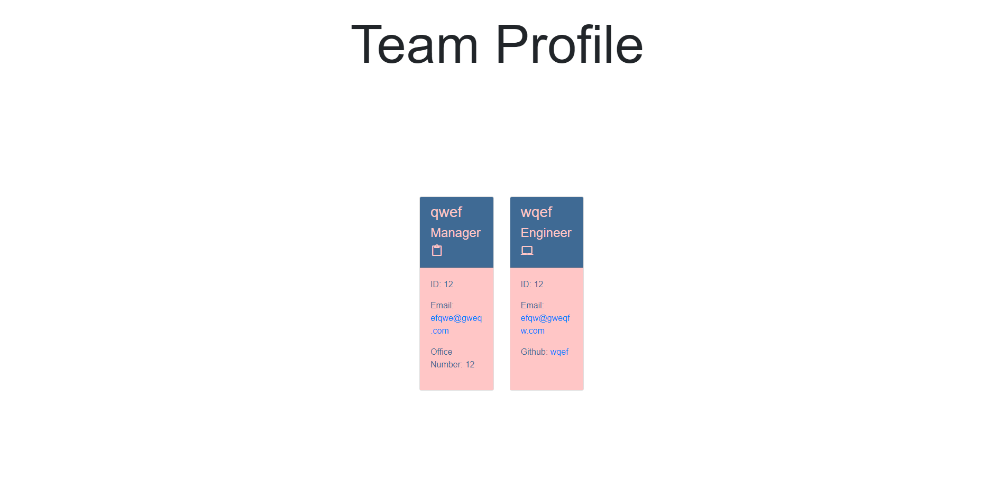

# Challenge 6 Weather API APPLICATION

This challange required students to create a team profile generator which will generate HTML according to the userings input data.

Contains: - HTML - CSS - JavaScript

Link: https://github.com/RyanZade/Challenge-10

RyanZade
The Walkthrough demo will be attached to the submission.
